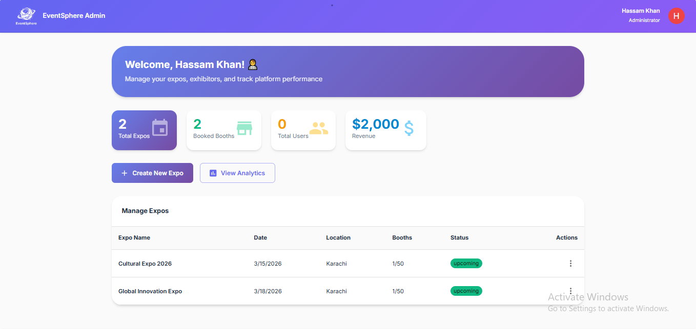
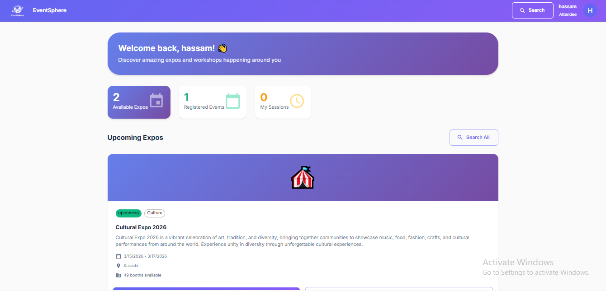

# 🎪 EventSphere Management System

A comprehensive full-stack web application for managing expos, trade shows, and exhibitions. Built with the MERN stack (MongoDB, Express.js, React, Node.js).

## 📋 Table of Contents

- [Overview](#overview)
- [Features](#features)
- [Tech Stack](#tech-stack)
- [Installation](#installation)
- [Usage](#usage)
- [API Documentation](#api-documentation)
- [Project Structure](#project-structure)
- [Screenshots](#screenshots)
- [Contributing](#contributing)
- [License](#license)
- [Contact](#contact)

---

## 🎯 Overview

EventSphere is a modern event management platform designed to streamline the organization and participation in expos and trade shows. It provides distinct interfaces for organizers, exhibitors, and attendees, making expo management efficient and user-friendly.

### Key Capabilities

- **For Organizers**: Create and manage expos, approve exhibitor applications, allocate booth spaces, schedule sessions
- **For Exhibitors**: Apply for booth spaces, manage company profiles, showcase products/services
- **For Attendees**: Browse expos, register for events, book sessions, explore exhibitors

---

## ✨ Features

### 🔐 Authentication & Authorization
- Secure JWT-based authentication
- Role-based access control (Admin, Organizer, Exhibitor, Attendee)
- Password encryption with bcrypt
- Profile management for all user types

### 👨‍💼 Admin/Organizer Features
- Create, edit, and delete expo events
- Manage expo details (title, dates, location, theme)
- Approve or reject exhibitor applications
- Allocate and manage booth spaces
- Create and schedule sessions/workshops
- Real-time analytics and reporting
- Dashboard with key metrics

### 🏢 Exhibitor Features
- Apply for booth spaces at expos
- Manage company profile and branding
- Update products/services offered
- View application status
- Manage assigned booths
- Track booth traffic and engagement

### 👥 Attendee Features
- Browse available expos
- Register for events
- View exhibitor directory
- Register for sessions and workshops
- Manage personal event schedule
- View booth locations and floor plans

### 📊 Additional Features
- Responsive design for all devices
- Real-time status updates
- Search and filter functionality
- Session capacity management
- Booth availability tracking

---

## 🛠️ Tech Stack

### Frontend
- **React 18** - UI library
- **React Router DOM** - Navigation
- **Axios** - HTTP client
- **CSS3** - Styling

### Backend
- **Node.js** - Runtime environment
- **Express.js** - Web framework
- **MongoDB** - Database
- **Mongoose** - ODM for MongoDB

### Authentication & Security
- **JWT (jsonwebtoken)** - Token-based authentication
- **bcryptjs** - Password hashing
- **CORS** - Cross-origin resource sharing
- **express-validator** - Input validation

---

## 📦 Installation

### Prerequisites

Before you begin, ensure you have the following installed:
- [Node.js](https://nodejs.org/) (v14 or higher)
- [MongoDB](https://www.mongodb.com/try/download/community) (v4.4 or higher)
- [Git](https://git-scm.com/downloads)

### Clone Repository

```bash
git clone https://github.com/YOUR_USERNAME/eventsphere-management.git
cd eventsphere-management
```

### Backend Setup

```bash
# Navigate to backend directory
cd backend

# Install dependencies
npm install

# Create .env file
# Copy .env.example to .env and update values
cp .env.example .env

# Edit .env file with your configuration
# PORT=5000
# MONGO_URI=mongodb://localhost:27017/eventsphere
# JWT_SECRET=your_super_secret_jwt_key
# NODE_ENV=development
```

### Frontend Setup

```bash
# Navigate to frontend directory (from project root)
cd frontend

# Install dependencies
npm install

# Create .env file (optional)
# REACT_APP_API_URL=http://localhost:5000/api
```

### Database Setup

```bash
# Start MongoDB service
# Windows:
net start MongoDB

# Mac/Linux:
sudo systemctl start mongod
```

---

## 🚀 Usage

### Development Mode

**Terminal 1 - Backend:**
```bash
cd backend
npm run dev
```
Backend runs on `http://localhost:5000`

**Terminal 2 - Frontend:**
```bash
cd frontend
npm start
```
Frontend runs on `http://localhost:3000`

### Production Build

```bash
# Build frontend
cd frontend
npm run build

# Serve frontend build with backend
cd ../backend
npm start
```

---

## 🔌 API Documentation

### Authentication Endpoints

| Method | Endpoint | Description | Access |
|--------|----------|-------------|--------|
| POST | `/api/auth/register` | Register new user | Public |
| POST | `/api/auth/login` | Login user | Public |
| GET | `/api/auth/profile` | Get user profile | Private |

### Expo Endpoints

| Method | Endpoint | Description | Access |
|--------|----------|-------------|--------|
| GET | `/api/expos` | Get all expos | Public |
| GET | `/api/expos/:id` | Get expo by ID | Public |
| POST | `/api/expos` | Create expo | Admin |
| PUT | `/api/expos/:id` | Update expo | Admin |
| DELETE | `/api/expos/:id` | Delete expo | Admin |
| POST | `/api/expos/:id/register` | Register for expo | Attendee |
| POST | `/api/expos/:id/sessions/:sessionId/register` | Register for session | Attendee |

### Exhibitor Endpoints

| Method | Endpoint | Description | Access |
|--------|----------|-------------|--------|
| POST | `/api/exhibitors/apply/:expoId` | Apply for booth | Exhibitor |
| GET | `/api/exhibitors/applications` | Get my applications | Exhibitor |
| GET | `/api/exhibitors/booths` | Get my booths | Exhibitor |
| PUT | `/api/exhibitors/profile` | Update profile | Exhibitor |
| GET | `/api/exhibitors/stats` | Get statistics | Exhibitor |

### Admin Endpoints

| Method | Endpoint | Description | Access |
|--------|----------|-------------|--------|
| GET | `/api/admin/dashboard` | Get dashboard stats | Admin |
| GET | `/api/admin/applications` | Get all applications | Admin |
| PUT | `/api/admin/applications/:id/approve` | Approve application | Admin |
| PUT | `/api/admin/applications/:id/reject` | Reject application | Admin |
| GET | `/api/admin/analytics/:expoId` | Get expo analytics | Admin |

### Attendee Endpoints

| Method | Endpoint | Description | Access |
|--------|----------|-------------|--------|
| GET | `/api/attendees/registered-expos` | Get registered expos | Attendee |
| GET | `/api/attendees/registered-sessions` | Get registered sessions | Attendee |
| PUT | `/api/attendees/profile` | Update profile | Attendee |

---

## 📁 Project Structure

```
eventsphere-management/
├── backend/
│   ├── models/
│   │   ├── User.js              # User schema
│   │   ├── Expo.js              # Expo schema
│   │   └── Application.js       # Application schema
│   ├── routes/
│   │   ├── auth.js              # Authentication routes
│   │   ├── expos.js             # Expo routes
│   │   ├── exhibitors.js        # Exhibitor routes
│   │   ├── attendees.js         # Attendee routes
│   │   └── admin.js             # Admin routes
│   ├── middleware/
│   │   └── auth.js              # Auth middleware
│   ├── .env.example             # Environment variables template
│   ├── server.js                # Express server setup
│   └── package.json             # Backend dependencies
│
├── frontend/
│   ├── public/
│   │   └── index.html
│   ├── src/
│   │   ├── components/
│   │   │   └── Navbar.js        # Navigation component
│   │   ├── pages/
│   │   │   ├── Login.js         # Login page
│   │   │   ├── Register.js      # Registration page
│   │   │   ├── ExpoList.js      # Expo listing page
│   │   │   ├── ExpoDetails.js   # Expo details page
│   │   │   ├── Profile.js       # User profile page
│   │   │   ├── AdminDashboard.js
│   │   │   ├── ExhibitorDashboard.js
│   │   │   └── AttendeeDashboard.js
│   │   ├── App.js               # Main app component
│   │   └── index.js             # Entry point
│   └── package.json             # Frontend dependencies
│
├── .gitignore                   # Git ignore file
├── README.md                    # Project documentation
└── LICENSE                      # MIT License
```

---

---

---

## 📸 Screenshots

### 🏠 Home Pages
<div align="center">
  
  
</div>
<div align="center">
  
  
</div>

### 🔐 Authentication
<div align="center">
  
  
</div>
<div align="center">
  
  
</div>

### 👨‍💼 Admin Dashboard

*Comprehensive analytics and event management*

### 🏢 Exhibitor Features
<div align="center">
  
  
</div>

### 👥 Attendee Interface

*Browse events and manage registrations*

### 🎪 Expo Management
<div align="center">
  
  
</div>
<div align="center">
  
  
</div>
<div align="center">
  
</div>

---

## 🧪 Testing

### Test Accounts

You can create test accounts for different roles:

**Admin Account:**
```json
{
  "email": "admin@eventsphere.com",
  "password": "admin123",
  "role": "admin"
}
```

**Exhibitor Account:**
```json
{
  "email": "exhibitor@company.com",
  "password": "exhibitor123",
  "role": "exhibitor"
}
```

**Attendee Account:**
```json
{
  "email": "attendee@example.com",
  "password": "attendee123",
  "role": "attendee"
}
```

---

## 🤝 Contributing

Contributions are welcome! Please follow these steps:

1. Fork the repository
2. Create a feature branch (`git checkout -b feature/AmazingFeature`)
3. Commit your changes (`git commit -m 'Add some AmazingFeature'`)
4. Push to the branch (`git push origin feature/AmazingFeature`)
5. Open a Pull Request

---

## 🐛 Known Issues

- File upload for documents not yet implemented
- Email notifications pending integration
- Mobile responsiveness needs improvement in some areas

---

## 🔮 Future Enhancements

- [ ] Payment gateway integration for booth bookings
- [ ] Email notifications for application status
- [ ] Real-time chat/messaging system
- [ ] QR code generation for attendee check-ins
- [ ] Advanced analytics with charts and graphs
- [ ] Export reports to PDF/Excel
- [ ] Multi-language support
- [ ] Mobile app development

---

## 📄 License

This project is licensed under the MIT License - see the [LICENSE](LICENSE) file for details.

---

## 👨‍💻 Author

**Your Name**
- GitHub: [@YourUsername](https://github.com/YOUR_USERNAME)
- LinkedIn: [Your LinkedIn](https://linkedin.com/in/your-profile)
- Email: your.email@example.com

---

## 🙏 Acknowledgments

- [Aptech Education](https://aptech-education.com/) - 5th Semester Project
- [MongoDB Documentation](https://docs.mongodb.com/)
- [React Documentation](https://react.dev/)
- [Express.js Documentation](https://expressjs.com/)
- [Node.js Documentation](https://nodejs.org/)

---

## 📞 Support

For support, email hassamkhan33344@gmail.com or create an issue in this repository.

---

## ⭐ Show Your Support

If you found this project helpful, please give it a ⭐️!

---

<div align="center">


*EventSphere Management System © 2026*

</div>
