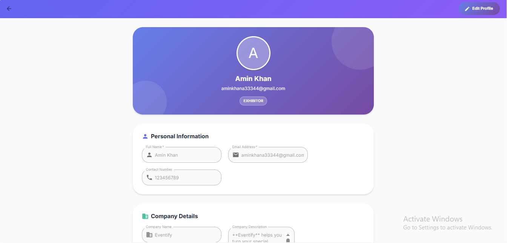
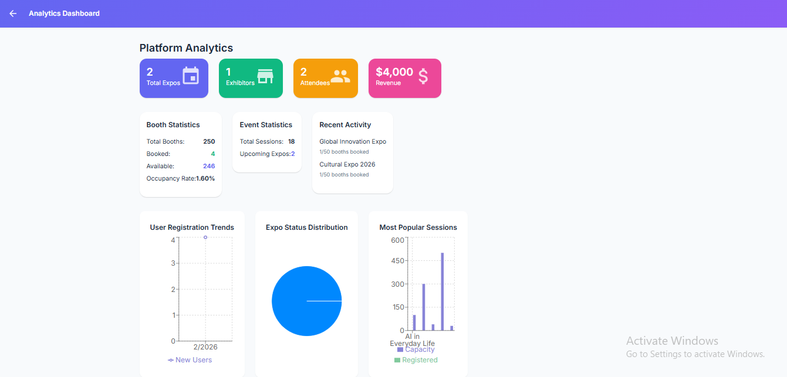
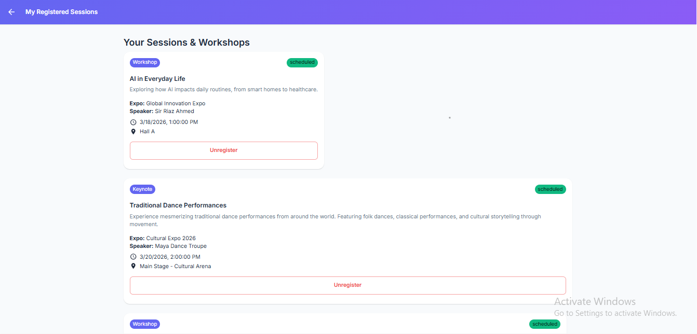

# 🎪 EventSphere Management System

A comprehensive full-stack web application for managing expos, trade shows, and exhibitions. Built with the MERN stack (MongoDB, Express.js, React, Node.js).


---

## 📋 Table of Contents

- [Overview](#overview)
- [Features](#features)
- [Tech Stack](#tech-stack)
- [Installation](#installation)
- [Usage](#usage)
- [API Documentation](#api-documentation)
- [Project Structure](#project-structure)
- [Screenshots](#screenshots)
- [Author](#author)

---

## 🎯 Overview

EventSphere is a modern event management platform designed to streamline the organization and participation in expos and trade shows. It provides distinct interfaces for organizers, exhibitors, and attendees, making expo management efficient and user-friendly.

### Key Capabilities

- **For Organizers**: Create and manage expos, approve exhibitor applications, allocate booth spaces, schedule sessions
- **For Exhibitors**: Apply for booth spaces, manage company profiles, showcase products/services
- **For Attendees**: Browse expos, register for events, book sessions, explore exhibitors

---

## ✨ Features

### 🔐 Authentication & Authorization
- Secure JWT-based authentication
- Role-based access control (Admin, Organizer, Exhibitor, Attendee)
- Password encryption with bcrypt
- Profile management for all user types

### 👨‍💼 Admin/Organizer Features
- Create, edit, and delete expo events
- Manage expo details (title, dates, location, theme)
- Approve or reject exhibitor applications
- Allocate and manage booth spaces
- Create and schedule sessions/workshops
- Real-time analytics and reporting
- Dashboard with key metrics

### 🏢 Exhibitor Features
- Apply for booth spaces at expos
- Manage company profile and branding
- Update products/services offered
- View application status
- Manage assigned booths
- Track booth traffic and engagement

### 👥 Attendee Features
- Browse available expos
- Register for events
- View exhibitor directory
- Register for sessions and workshops
- Manage personal event schedule
- View booth locations and floor plans

### 📊 Additional Features
- Responsive design for all devices
- Real-time status updates
- Search and filter functionality
- Session capacity management
- Booth availability tracking

---

## 🛠️ Tech Stack

### Frontend
- **React 18** - UI library
- **React Router DOM** - Navigation
- **Axios** - HTTP client
- **CSS3** - Styling

### Backend
- **Node.js** - Runtime environment
- **Express.js** - Web framework
- **MongoDB** - Database
- **Mongoose** - ODM for MongoDB

### Authentication & Security
- **JWT (jsonwebtoken)** - Token-based authentication
- **bcryptjs** - Password hashing
- **CORS** - Cross-origin resource sharing
- **express-validator** - Input validation

---

## 📦 Installation

### Prerequisites

Before you begin, ensure you have the following installed:
- [Node.js](https://nodejs.org/) (v14 or higher)
- [MongoDB](https://www.mongodb.com/try/download/community) (v4.4 or higher)
- [Git](https://git-scm.com/downloads)

### Clone Repository

```bash
git clone https://github.com/YOUR_USERNAME/eventsphere-management.git
cd eventsphere-management
```

### Backend Setup

```bash
# Navigate to backend directory
cd backend

# Install dependencies
npm install

# Create .env file
PORT=5000
MONGO_URI=mongodb://localhost:27017/eventsphere
JWT_SECRET=your_super_secret_jwt_key
NODE_ENV=development
```

### Frontend Setup

```bash
# Navigate to frontend directory (from project root)
cd frontend

# Install dependencies
npm install
```

### Database Setup

```bash
# Start MongoDB service
# Windows:
net start MongoDB

# Mac/Linux:
sudo systemctl start mongod
```

---

## 🚀 Usage

### Development Mode

**Terminal 1 - Backend:**
```bash
cd backend
npm run dev
```
Backend runs on `http://localhost:5000`

**Terminal 2 - Frontend:**
```bash
cd frontend
npm start
```
Frontend runs on `http://localhost:3000`

---

## 🔌 API Documentation

### Authentication Endpoints

| Method | Endpoint | Description | Access |
|--------|----------|-------------|--------|
| POST | `/api/auth/register` | Register new user | Public |
| POST | `/api/auth/login` | Login user | Public |
| GET | `/api/auth/profile` | Get user profile | Private |

### Expo Endpoints

| Method | Endpoint | Description | Access |
|--------|----------|-------------|--------|
| GET | `/api/expos` | Get all expos | Public |
| GET | `/api/expos/:id` | Get expo by ID | Public |
| POST | `/api/expos` | Create expo | Admin |
| PUT | `/api/expos/:id` | Update expo | Admin |
| DELETE | `/api/expos/:id` | Delete expo | Admin |
| POST | `/api/expos/:id/register` | Register for expo | Attendee |

### Exhibitor Endpoints

| Method | Endpoint | Description | Access |
|--------|----------|-------------|--------|
| POST | `/api/exhibitors/apply/:expoId` | Apply for booth | Exhibitor |
| GET | `/api/exhibitors/applications` | Get my applications | Exhibitor |
| GET | `/api/exhibitors/booths` | Get my booths | Exhibitor |
| PUT | `/api/exhibitors/profile` | Update profile | Exhibitor |

### Admin Endpoints

| Method | Endpoint | Description | Access |
|--------|----------|-------------|--------|
| GET | `/api/admin/dashboard` | Get dashboard stats | Admin |
| GET | `/api/admin/applications` | Get all applications | Admin |
| PUT | `/api/admin/applications/:id/approve` | Approve application | Admin |
| PUT | `/api/admin/applications/:id/reject` | Reject application | Admin |

---

## 📁 Project Structure

```
eventsphere-management/
├── backend/
│   ├── models/
│   │   ├── User.js
│   │   ├── Expo.js
│   │   └── Application.js
│   ├── routes/
│   │   ├── auth.js
│   │   ├── expos.js
│   │   ├── exhibitors.js
│   │   ├── attendees.js
│   │   └── admin.js
│   ├── .env
│   ├── server.js
│   └── package.json
├── frontend/
│   ├── src/
│   │   ├── components/
│   │   │   └── Navbar.js
│   │   ├── pages/
│   │   │   ├── Login.js
│   │   │   ├── Register.js
│   │   │   ├── ExpoList.js
│   │   │   ├── ExpoDetails.js
│   │   │   ├── Profile.js
│   │   │   ├── AdminDashboard.js
│   │   │   ├── ExhibitorDashboard.js
│   │   │   └── AttendeeDashboard.js
│   │   ├── App.js
│   │   └── index.js
│   └── package.json
├── screenshots/
├── .gitignore
└── README.md
```

---

## 📸 Screenshots

### 🏠 Home Pages
<div align="center">
  
  
</div>

<div align="center">
  
  
</div>

### 🔐 Authentication
<div align="center">
  
  
</div>

<div align="center">
  
  
</div>

### 👨‍💼 Admin Dashboard


*Comprehensive analytics and event management*

### 🏢 Exhibitor Features
<div align="center">
  
  
</div>

### 👥 Attendee Interface


*Browse events and manage registrations*

### 🎪 Expo Management
<div align="center">
  
  
</div>

<div align="center">
  
  
</div>

<div align="center">
  
</div>

---

## 👨‍💻 Author

**Hassam Uddin Khan**
- GitHub: [@hassamkhan](https://github.com/hassamkhan)
- LinkedIn: [Hassam Uddin Khan](https://linkedin.com/in/hassam-khan)
- Email: hassamkhan33344@gmail.com

### 🚀 Other Projects

**Go Local** — Flutter-based Android app for exploring attractions and events across Pakistan. Features Firebase Authentication, Firestore, and Google Maps integration.

**Employee Management System** — Web-based CRUD application for managing employee records with secure admin authentication and data validation.

---

## 🙏 Acknowledgments

- [Aptech Education](https://aptech-education.com/) - 5th Semester Project
- [MongoDB Documentation](https://docs.mongodb.com/)
- [React Documentation](https://react.dev/)
- [Express.js Documentation](https://expressjs.com/)
- [Node.js Documentation](https://nodejs.org/)

---

## 📧 Support

For support, email hassamkhan33344@gmail.com or create an issue in this repository.

---

## ⭐ Show Your Support

If you found this project helpful, please give it a ⭐️!

---
